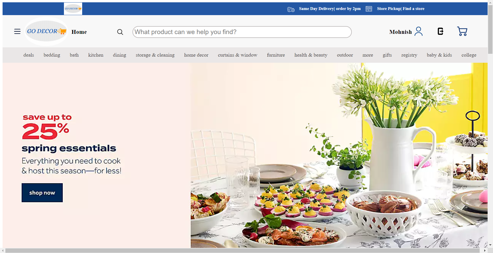
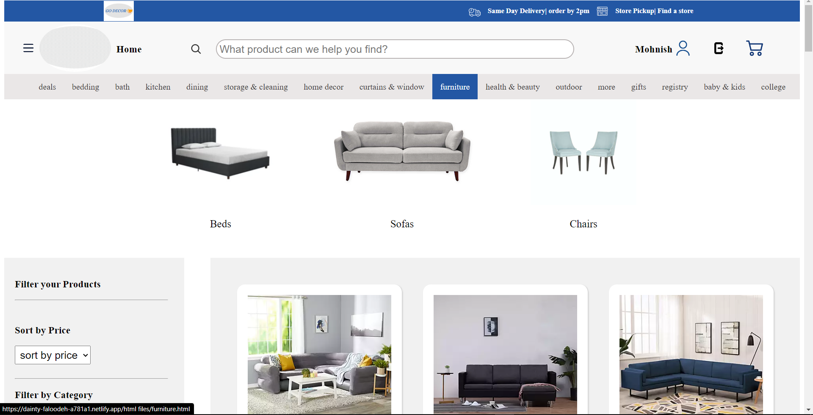
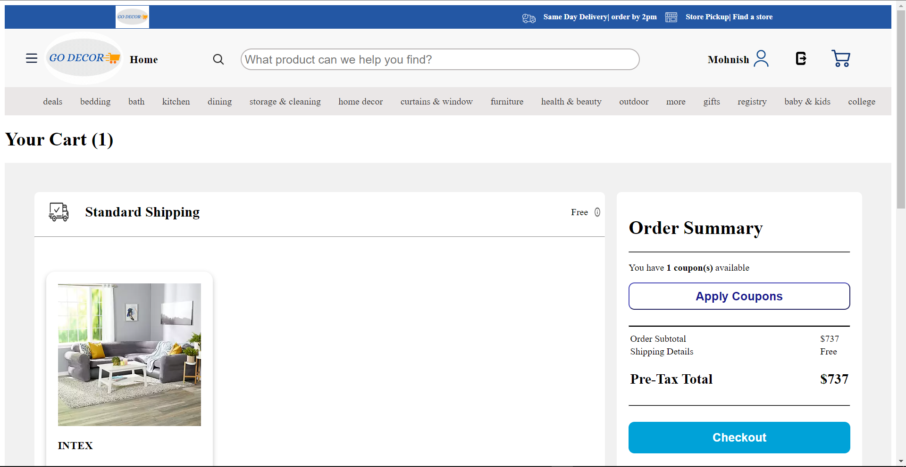
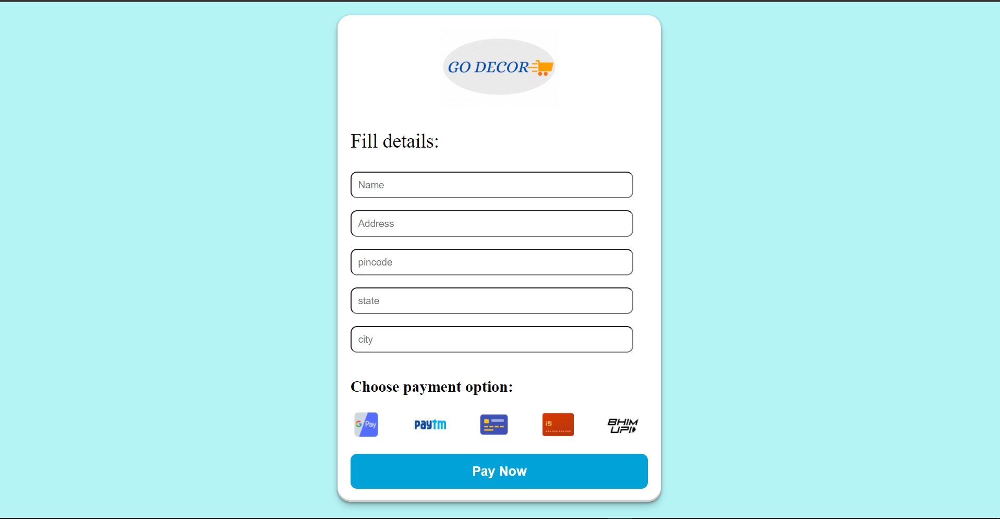

# Go Decor

 <b>Bed Bath & Beyond</b> is a popular retail store in the United States that offers a wide range of products for the home, including bedding, bath essentials, kitchen appliances, home decor, and more. The Bed Bath & Beyond website provides customers with a convenient and seamless online shopping experience.

 **Deployed Link** - **https://dainty-faloodeh-a781a1.netlify.app**

# Tech Stacks

# Deployed

# Features
- User Authentication
- Product Searching
- Product Sorting 
- Product Filtering
- Add to Cart
- Checkout Page

# Different Pages of Website

## Homepage

## Product Page

## Cart Page

## Checkout Page

## For Contact
- Email - **mohnish201@gmail.com**

